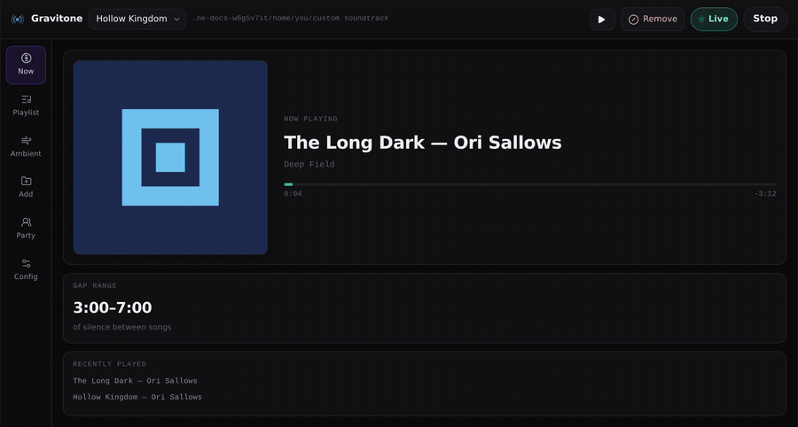

# Gravitone

Plays music you already own behind a game. Shuffled, with a long random gap
after each song. That is the whole idea.

<br clear="left">

The gap is the part people get wrong. A soundtrack that never stops is just
a radio, and after twenty minutes you stop hearing it. Three to seven
minutes of nothing, then a song, and the song is an event again. Set the
gaps to zero if you disagree; it is a number in a config file.

A graviton is the particle that would carry gravity, if anyone ever catches
one. A tone is what you would hear if it arrived. The mark is a mass with
the waves coming off it.



The command is `gravitone`, or `grav` if you are in a hurry.

## What it does

- **Nothing is copied.** Link a file and you get a symlink in your library
  folder pointing at where the file already lives. A 40 GB collection costs
  a few KB of directory entries. Point a playlist at a whole folder instead
  and it plays in place, including whatever you drop in next week.
- **Playlists**, one per game or per mood. Each has its own links, its own
  folders, and remembers which tracks you threw out of it. Switching takes
  effect at the next track.
- **Gaps**, 3 to 7 minutes of silence by default. Turn on ambience and a
  share of them become rain, wind or room tone from your `ambient` folder
  instead. Tunable from zero to an hour. Hideable, if a countdown ruins it
  for you.
- **Listening together with no server.** A 32 character code and a clock put
  two machines on the same evening. Nothing runs between them.
- **A control panel in your browser**, or on your phone as a remote. Plain
  HTML and JavaScript off Python's own HTTP server. No Electron, no build
  step, no dependencies, nothing fetched from the internet.
- **No Python dependencies at all.** Playback shells out to `ffplay`, `mpv`,
  `afplay` or `vlc`, whichever you have.

## Install

Download `gravitone-<version>.zip` from the
[latest release](https://github.com/cheekoala/custom_bg_game_soundtrack_player/releases/latest),
unpack it, and run the installer for your machine.

| | |
| --- | --- |
| Linux, macOS, \*BSD, WSL | `./install.sh`, or double-click it |
| Windows | right-click `install.ps1`, *Run with PowerShell* |

Both drop the thing in a private virtualenv, put `gravitone` and `grav` on
your PATH, offer to install an audio player if you have none, and then check
that the command they claim to have installed actually runs. `--yes` / `-Yes`
takes every default without asking, which is what you want over SSH.

You also need one of `ffmpeg` (for `ffplay`), `mpv` or `vlc`. The installers
offer to fetch one. `gravitone doctor` tells you what you have.

From a checkout, if you would rather:

```sh
git clone https://github.com/cheekoala/custom_bg_game_soundtrack_player
cd custom_bg_game_soundtrack_player
./install.sh                 # --with-player installs ffmpeg without asking
```

Or by hand, anywhere:

```sh
pipx install .          # or: pip install --user .
```

The rest of the flags:

- `--shortcut` / `--no-shortcut` (`-Shortcut` / `-NoShortcut`) decides about
  a menu entry and a desktop icon up front instead of asking.
- `--path` / `--no-path` decides about putting `~/.local/bin` on your PATH.
  Skip it and `gravitone` installs fine and then says `command not found`,
  which is nobody's idea of a good time. It writes one line to your shell's
  own profile, once. Open a new terminal afterwards, or use the full path:
  `~/.local/bin/gravitone ui`.
- `--prefix DIR` puts the commands somewhere else entirely.

Double-clicking `install.sh` in Dolphin, Nautilus or Thunar used to look like
nothing happened. A file manager runs a script with no terminal attached, so
everything it prints goes into a pipe nobody reads and its questions have
nowhere to appear. It now notices and reopens itself in a terminal (konsole,
gnome-terminal, xfce4-terminal, kitty, alacritty, foot, xterm, whichever you
have). `--no-terminal` if you want it to stay put and shut up.

Installing over an existing copy is an upgrade. It says so
(`Upgrading gravitone 1.0.0 -> 1.1.0`) and leaves your library, playlists and
settings alone.

`./install.sh --uninstall` and `.\install.ps1 -Uninstall` take it off again,
also leaving your library and config alone. Add `--purge` / `-Purge` if you
want the settings gone too. `make help` has the same things for developers.

[What changed between versions](CHANGELOG.md).

## Use

```sh
gravitone ui
```

That starts the server and opens the page. Opening `gravitone/ui/index.html`
from the folder by hand gets you a dead page: no server to talk to, so no
library, no file browser, no playback. The page says as much if you land
there.

Only one UI runs at a time. Start it again and it opens the browser at the
one already running rather than fighting it for the port. If 8765 is taken by
something else it moves to the next free port and tells you; with an explicit
`--port` it reports the clash instead of wandering off.

```sh
gravitone ui --status      # is one running, where, since when
gravitone ui --stop        # stop it
gravitone ui --new         # start a second one anyway
```

Or skip the browser:

```sh
gravitone init                                    # create the library folder
gravitone playlist new "Hollow Kingdom" --folder ~/Music/Nier --use
gravitone playlist new "Field Work" --folder ~/Sounds/recordings
gravitone folder add --ambient ~/Sounds/weather   # into the selected playlist
gravitone link ~/Music/Outer\ Wilds               # or link track by track
gravitone play
```

While playing in a terminal, `n` skips, `r` removes (skip, and out of this
playlist), `q` quits.

```
♪ Ashes.flac
  ~ rain.ogg (0:34)
♪ Village.mp3
  . silence (0:19)
```

## The UI

`gravitone ui` serves a control panel on `127.0.0.1:8765`.

| | |
| --- | --- |
|  |  |
|  |  |
|  | |

**Top bar.** The playlist selector, and switching it switches what plays. Its
last entry, "New playlist…", takes you to where one gets named. The button
next to it says what pressing it does: Play, then Stop. A green Live badge
says something is sounding. The button is never the status. You should not
have to press the word "Live" to make things stop.

**Now.** What is playing, named off its tags, with the album under it and the
cover beside it. Or how long the current gap runs. Tags for the playing track
are read on the spot, so this works whether or not you have ever opened the
track table.

**Playlist / Ambient.** What this playlist plays, and what fills the gaps.
`✕` removes a link, never a file.

**Add.** "Choose a folder…" opens your desktop's own folder dialog, which
needs Tk; `gravitone doctor` says whether you have it. Otherwise use the
built-in browser or paste a path. A browser file picker hands over file
*contents*, never paths, and paths are the entire point here.

The built-in browser behaves like a file manager and not like a list: Back
(where you were), Up (the folder above), Home, and a breadcrumb where every
step is clickable. Each folder says what is in it, *5 tracks · 2 folders*,
and the chevron opens it where it stands, indenting the contents underneath
instead of taking you somewhere else. You can read a box of albums without
walking in and out of it fifteen times. Every folder row offers "Add folder"
(the whole thing joins the playlist, live) and "Link files" (just the files
in it now, as symlinks).

**Config.** Gaps, levels, fade, shuffle, loop, your playlists, this
playlist's folders and removed tracks, export and import. The Server card
shows the address, the process id, how long it has been up and its version,
with Restart and Stop buttons. Restart replaces the process in place, keeping
the same port and the same token, so the page you clicked it from reconnects
by itself. Ambience is a
switch, with the chance slider folded away behind it. A slider at 0% says the
same thing, but off is not a number anybody wants to set. Changes save
immediately and apply from the next gap. Nothing needs restarting.

On a wide screen the artwork gets room: 288px in Now, 68px thumbnails in the
table, falling back to 148/34 on a tablet and 96/34 on a phone. It is a music
player. You should be able to see the records.

Keys: `space` play/stop, `n` next, `r` remove (`b` still works). Every API
call carries a token in the URL, so some other page in your browser cannot
drive your player or read your disk.

As a phone remote for the machine that is playing:

```sh
gravitone ui --host 0.0.0.0        # prints a LAN URL with the token in it
```

Anyone holding that link can control playback. Use it on networks you trust.

## Speed and stability

The page polls once a second. The playing clock does not wait for it: each
answer is a fix, and between fixes the progress bar and the times run on
their own at one second per second, snapping back only if the server says
something different. Before that, a late answer showed up as the bar sitting
still and then lurching four seconds.

Skip and Remove fade the sound out before stopping it, so the button keeps
its spinner until the music has actually moved, not until the request comes
back. While it waits it polls faster, so it catches the change as it happens.
Buttons hold their size while they spin, because a button that resizes under
the cursor is worse than no feedback at all.

Everything that walks the disk happens on one background worker and never on
a request. The folder index goes in `~/.config/gravitone/index.json`, so a
restart starts with answers instead of work, and the state the UI polls is
recomputed only when something changes. On a 2000 file library a poll costs
about 0.02 ms; it used to re-walk every folder. Tag reads and cover
extraction are background work too, and the Server card in Config shows
what is being chewed on.

The track table builds 400 rows at a time and has a search box, so a library
of thousands does not park tens of thousands of nodes in the DOM. "Show all"
is there when you want it. A refresh that would draw the same rows patches
them in place instead of rebuilding the table, so where you scrolled to stays
where you scrolled to while tags and covers fill in around you.

Anything in flight draws a thin sweeping bar across the top of the window. A
library that takes a second to arrive shows placeholder rows rather than an
empty table.


## Playlists

Two folders you already think of as two playlists? Make them two:

```sh
gravitone playlist new "Hollow Kingdom" --folder ~/Music/hollow-kingdom --use
gravitone playlist new "Night Drive"    --folder ~/Music/night-drive
gravitone playlist list
gravitone playlist use "Night Drive"
```

Or pick them from the selector in the top bar. A playlist owns three things:
its folders, played in place; its own links, under
`custom soundtrack/playlists/<id>/`; and its removals.

A removal stays local to the playlist. Take a track out with `✕` or
`gravitone unlink NAME` and it stays out of *this* playlist, across restarts.
The same file keeps playing in any other playlist that points at it, and the
file itself is never touched. Put it back from Config, "Removed from this
playlist", or `gravitone playlist restore --all`.

Removing a linked track deletes that playlist's link instead. There is
nothing to remember, and the other playlists keep theirs.

Switching playlist mid-song takes effect at the next track, not the next full
pass. Same for linking, removing, and adding a folder.

The playlist called Library is the plain `custom soundtrack/music` and
`/ambient` folders, so an install from before playlists existed keeps working
exactly as it did.

Playlists live in `~/.config/gravitone/playlists.json`. Plain JSON, readable,
back it up or edit it by hand.

## The library

```
custom soundtrack/
├── music/                       the Library playlist's symlinks
├── ambient/                     its ambience
└── playlists/
    └── survival-soundtrack/     every other playlist gets its own pair,
        ├── music/               named after the playlist
        └── ambient/

plus any folders you added, played where they stand
```

Linked files are curated one at a time and stay put even if you reorganise
the original folder later. Folders are the lazy option: point a playlist at
`~/Music/Soundtracks` and every audio file under it plays, including whatever
you add next week. A file reachable both ways is played once, not twice.

```sh
gravitone folder add ~/Music/Soundtracks      # a music folder for this playlist
gravitone folder add --ambient ~/Sounds       # an ambience folder
gravitone folder list                         # with per-folder track counts
gravitone folder remove ~/Music/Soundtracks   # the folder itself is untouched
gravitone ui --pick                           # pick one from a system dialog
```

(`gravitone source` still works. Same command, older name.)

### The folder is the playlist

A linked track is a real symlink, so the playlist is browsable in Dolphin,
Finder or Explorer as well as in here. Sort it, open a track, drag one out.
Two things trip people up:

- **A named playlist does not live in `custom soundtrack/music`.** That
  folder belongs to the Library playlist. Everything else is under
  `playlists/<name>/`. Config, "This playlist on disk", shows the exact path
  and has a button to copy it.
- **A folder added whole links nothing.** It plays in place. That is the
  point of it, so its folder on disk is empty, and if you go looking in your
  file manager you will find exactly zero files. Press "Mirror as links" and
  every track the playlist plays gets a symlink of its own, without copying a
  byte or changing what plays. Running it twice does nothing the second time.

Because entries are plain symlinks you can manage the folder by hand: drag
links in, rename them to change the sort order, delete one to drop a track.
Non-audio files and dangling links are ignored.

On Windows symlinks need Developer Mode (Settings, System, For developers).
Without it Gravitone falls back to hard links, which also cost no extra space
but cannot cross drives. Adding a folder whole needs neither.

## Commands

| Command | |
| --- | --- |
| `gravitone ui` | open the control panel (`--host 0.0.0.0` for a phone remote) |
| `gravitone play` | play in the terminal (`n` next, `q` quit) |
| `gravitone link PATH...` | symlink files/folders in (`--ambient`, `--no-recursive`, `--relative`) |
| `gravitone folder add\|remove\|list` | put whole folders in this playlist (`--ambient`) |
| `gravitone playlist list\|new\|use\|rename\|remove` | switch between sets of music |
| `gravitone playlist removed\|restore` | see and undo removals in this playlist |
| `gravitone export PATH [--bundle\|--format csv]` | write playlists out, with or without the audio |
| `gravitone import PATH` | read one back in as new playlists |
| `gravitone list --sort album` | order by name, title, artist, album or length |
| `gravitone play --hidden` | play without ever showing gap lengths |
| `gravitone ui --stop\|--new` | stop the running control panel, or start a second |
| `gravitone unlink NAME...` | remove entries (only ever deletes symlinks, never real files) |
| `gravitone list --targets` | show the library and what each link points at |
| `gravitone prune` | drop links whose target moved or was deleted |
| `gravitone doctor` | check folders, tracks and available players |

Any command takes `--playlist NAME` to act on a playlist without selecting
it. `--relative` writes relative symlinks, which keep working if the library
and your music move together, e.g. both on one external drive.

## Gaps between songs

Every song is followed by a gap of random length between `gap_min` and
`gap_max`. Each gap independently becomes either ambience (probability
`ambient_chance`, a random track from `ambient/`, cut to the gap length) or
plain silence. Gaps shorter than `ambient_min_tail` stay silent, because a
two second smear of rain sounds like a bug.

| Setting | Default | |
| --- | --- | --- |
| `gap_min` / `gap_max` | `180` / `420` | gap length range in seconds, up to `3600` |
| `ambient_chance` | `0.0` | share of gaps that get ambience. `0` is silence throughout, which is what the Ambience switch in Settings turns off |
| `ambient_min_tail` | `3.0` | shortest gap worth filling with ambience |
| `ambient_random_start` | `true` | drop into an ambient track at a random point |
| `hide_gaps` | `false` | never show how long a gap runs |
| `sort_by` | `name` | list and play order: name, title, artist, album or length |
| `sort_desc` | `false` | reverse that order |
| `show_filenames` | `true` | first column is the file on disk, not the title tag |
| `volume` / `ambient_volume` | `70` / `45` | ambience sits under the music |
| `shuffle` | `true` | shuffled passes, no repeat until all have played |
| `loop` | `true` | start a new pass when the list runs out |
| `root` | `~/.local/share/custom soundtrack` | library location |

The gap sliders reach an hour on a curved scale, so the first third of the
travel still covers 0 to 60 seconds. Or type an exact value into the box next
to them: `90`, `90s`, `3m`, `2m30` and `1:30` all parse.

Hidden mode (`hide_gaps`, or `gravitone play --hidden`) withholds gap lengths
server-side. The browser is never told how long the quiet is or how much of
it is left, so there is no countdown to watch and nothing to peek at in the
network tab. Songs still show their progress.

Ambient start points are randomised by default, so a twenty minute rain
recording does not open on the same three seconds every time. That needs
`ffprobe` to know how long the file is; without it ambience starts at the
top. The offset always leaves enough track to cover the whole gap.

Change them for good, or for one session:

```sh
gravitone config gap_min=30 gap_max=120 ambient_chance=0.8   # saved
gravitone config                                             # show everything
gravitone play --gap-min 60 --gap-max 180 --no-ambient       # this run only
```

Other `play` flags: `--volume`, `--ambient-volume`, `--no-shuffle`,
`--no-loop`, `--player ffplay|mpv|afplay|vlc`, and `--seed N` for a
reproducible shuffle and gaps.

Settings live in `~/.config/gravitone/config.json`. `GRAVITONE_ROOT` and
`GRAVITONE_CONFIG` override the paths, and `--root` / `--config` override
them per command, which is handy for a separate library per game.

## Remove

Remove sits next to skip and never moves. Press it, or `r`, and a confirm
button drops down on its own layer with the track named on it. The buttons
underneath do not move, so the thing under your cursor is still the thing you
were aiming at. Press the confirm, or `r` again, to go through with it. Click
anywhere else, press Escape, or wait eight seconds and it forgets.

Confirming skips the track and takes it out of the current playlist. Same
removal the `✕` does, so a track from a folder is only remembered as gone and
the file is never touched. Undo it in Config, "Removed from this playlist".

The confirm names the track it armed on and the server checks that name
before acting, so if the music moved on while the confirm sat there, nothing
gets removed. Remove during ambience takes out the ambient track instead.
During silence there is nothing to remove.

## Album art

Covers come out of the picture inside the file and nowhere else. A
`cover.jpg` sitting in the folder is somebody else's idea of what the record
looks like. Tag your files properly and this works.

Plenty of rips carry the picture on one track and not the rest, so a record
gets read across its first few files before it is written off as coverless.
Both answers, the cover and the "there is none", go in
`~/.config/gravitone/covers/index.json`, so a restart asks nothing twice.

**A record is a folder plus an album tag, not just a folder.** Keeping a
whole game's music in one directory is normal, and one answer per directory
meant whichever album happened to be listed first decided for everything
below it. Six coverless tracks at the top of a folder hid the art on all the
rest. Tracks are grouped by what their album tag says, and only the tracks of
that album get read looking for its picture.

The picture is lifted out byte for byte and the format is read off the bytes
rather than off the type the tagger wrote down. A JPEG filed as `image/png`
is common, and decoding by the label fails outright: the wrong decoder gets
picked and refuses a picture that is perfectly fine. It is shrunk to 600px
afterwards, from the file, not from the label.

Before running ffmpeg at all the file header is checked for an attached
picture. 45 ms to ask, versus about 3 seconds for ffmpeg to scan a whole file
and find nothing.

Config, "Find album art", goes through the playlist in the background reading
records nobody has asked about yet. "Look again" throws every answer away and
re-reads the lot, for when you have added art to files. Tags get read first,
since they are what says where one record ends and the next begins. Art is
cached in `~/.config/gravitone/covers/`, one file per record, because a
record shares its cover. `gravitone doctor` says how many records have art
and how many are known not to.

A cover is fetched once per record and not once per track, with an ETag and a
week of cache headers. The page token lives in `~/.config/gravitone/token`
rather than being made up at every start, so a restart reuses the browser's
cached art instead of re-fetching the lot. `gravitone ui --new-token` throws
the old one away when you actually want that.

## The track table

Track number, title, artist, album, length. Clicking a column header sorts by
it, the same header again reverses it. The order sticks, because it is a
setting, and it is also the play order when shuffle is off.

The "File names" switch decides what the first column is: the file on disk,
or the title tag. Whichever it shows is what its header sorts by, so the
column and the sort never disagree.

```sh
gravitone list --sort album        # name, title, artist, album, length
gravitone config sort_by=artist sort_desc=true
```

Tags come from `ffprobe`. Anything it cannot read falls back to the path.
`Artist/Album/03 Title.flac` is a convention for a reason. A guessed artist
or album is shown in italics rather than passed off as a tag. Tags are read
in the background and cached in `~/.config/gravitone/tags.json`, so a listing
never blocks on a probe: the table fills in the moment each read lands, and
says how many are left.

### Searching

Every list has a search box. Type and the table narrows as you go, matching
across file name, title, artist, album and path. Several words all have to
match, in any order and any field, so `bell vela` finds the Vela track by
Bell. It says `3 of 7` next to the box. `/` or Ctrl-F jumps to it from
anywhere on the page, Escape clears it.

The header stays put while you scroll. Columns keep their share of the width
and truncate with an ellipsis, with the full value in the tooltip, so a
sprawling album title cannot push the table out of its panel. On a phone the
artist, album and length columns fold away and the filter box takes its own
line. The window is 1440px wide at most, so a desktop gets a properly wide
table without the settings cards stretching into something silly.

## Export and import

Two shapes, for two different jobs:

```sh
gravitone export ~/gravitone-library.json                    # a manifest
gravitone export ~/library.csv --format csv                  # the same, flat
gravitone export ~/share.zip --bundle --only "Night Drive"   # with the audio
gravitone import ~/share.zip                                 # adds, never overwrites
```

A manifest is small readable JSON listing each playlist's folders, links and
removals. It points at files rather than carrying them, which is what you
want for your own backup or for moving to a machine that has the same music
on it. Import reports anything that is not there.

A bundle is a zip with the audio in it, so someone else can unpack it and
hear what you hear. Importing one unpacks to
`custom soundtrack/imported/<name>/` and builds playlists that play it. Paths
inside a bundle are checked before extraction, so a zip cannot write outside
that folder.

### Converting on the way in

Four hundred FLACs is about fifteen gigabytes, which is not a thing you send
anybody. A bundle can convert as it packs:

```sh
gravitone export ~/share.zip --bundle --audio mp3 --dry-run   # how big?
gravitone export ~/share.zip --bundle --audio mp3             # about a fifth
gravitone export ~/share.zip --bundle --audio opus            # about a tenth
```

| `--audio` | roughly | cover art |
| --- | --- | --- |
| `original` | whatever it is now | kept |
| `mp3` | ~245 kbps | kept |
| `mp3-small` | ~115 kbps | kept |
| `opus` | ~96 kbps | dropped, Ogg Opus has nowhere to put it |

Tags come across, and so does the embedded cover except for Opus. Your
library is never opened for writing: a conversion reads a file and writes a
new one into a temporary folder on its way into the zip.

It tells you what it will weigh before it starts. The guess is length times
bitrate, which on real music lands within a couple of percent. A 16 track,
310 MB FLAC playlist was guessed at 61 MB of MP3 and came out at 60.

Tracks convert several at a time, one process per core. Those 16 took 29
seconds on one lane and 7.5 on four. Four hundred is a few minutes rather
than most of an hour.

In the control panel this is Config, "Export & import": pick the format, read
the estimate, and it packs in the background with a progress bar and a Stop
button. Stopping deletes the half-written zip rather than leaving something
that looks finished. It uses your desktop's save/open dialog where there is
one and a path box where there is not. Import always adds: a name that
already exists becomes `Hollow Kingdom (2)` rather than replacing anything.

## Listening together

Two machines, the same music at the same moment, with nothing between them.
No server, no connection, nothing to keep alive. Gravitone does not stream
and it does not follow. Both ends work out the same evening from the same
code.

```sh
gravitone party new --save /nas/music/gravitone-party.json
gravitone party join 07PW-8BJW-01NA-NA8J-RN5W-W03R-0714-27G7
gravitone party status
gravitone party leave
```

Or the Party card in the control panel: "Start a party" gives you a code to
read out, "Join a party" takes one.


### How it can possibly work

A session is not a stream, it is a timetable, and the timetable is a pure
function of three things. A **seed**: every choice the engine makes, the
shuffle, how long a gap runs, whether it is silence or wind, where in the
wind it starts, comes out of one generator. A **roster**: the tracks, in an
order both sides arrive at independently, with the lengths the party was
planned against. An **epoch**: the instant the first track started.

Everything after that is arithmetic. "What is playing at 21:47:12" has one
answer, and two machines that agree on the clock agree on the music without
ever speaking. Join at nine for a party that started at seven and you land in
the middle of the track everyone else is in the middle of. Shut the lid for
ten minutes and you come back in step, not ten minutes behind.

Nothing drifts either, because every item is pinned to an absolute instant
rather than started whenever the last one happened to finish. A track that
runs a second short just leaves a second more quiet, and since the gap is
silence or weather anyway, the slop is inaudible. That is the one real
advantage of a player built around long random gaps: it has shock absorbers.

### The code, and the file

The code is 32 characters of [Crockford base32](https://www.crockford.com/base32.html),
which drops I, L, O and U so nothing reads as something else down a voice
call. It carries the seed, the epoch, a fingerprint of the roster, and the
settings that shape the gaps: `gap_min`, `gap_max`, `ambient_chance`,
`ambient_min_tail`, `ambient_random_start`, `shuffle` and `loop`. Those have
to travel, because the silences are part of the party and not a local
preference. Volume, fade, hidden mode and which player you use stay yours.
They change nothing about when the next track starts.

What the code cannot carry is 300 tracks, so the party file does. Put it next
to the music you are already sharing. Whoever takes it keeps the roster by
fingerprint, and from then on the code alone is enough. You only need the
file again when the set of tracks changes.

If both libraries hold exactly the same playlist, even the first code works
on its own: joining searches every playlist on the machine for one that
matches, and switches to it.

### Matching music, not paths

A track is identified by what it is: title, artist and album, normalised for
case, accents and punctuation, falling back to the file name when there are
no tags. Not by path, because the other person keeps their music somewhere
else entirely. Not by bytes either, because re-tagging a file rewrites them
without changing a note.

So the two libraries need nothing in common but the music.

- **Bigger on their side?** Their extra tracks are simply not in the party.
- **Smaller?** What they lack plays as silence for them, for exactly as long
  as it plays for you, and Gravitone names what is missing so they can go and
  fetch it. Drop the files in mid-party and they join at their next turn.
- **Different folder layout, different file names, different tagger?** Fine.

### Skipping, and the lid

In a party, skip sits a track out. The sound stops, your place does not, and
you are back with everyone at the next track. It cannot put you out of step,
so there is no warning to click through. But a button whose entire visible
effect is silence looks broken, so the page says what it did and keeps saying
it until the party moves on by itself: a note that stays put instead of
fading after three seconds, and "Sitting this one out" where the player would
normally name what is on. Click the note to wave it away.

Remove is off for a track that is not on your machine, and a track you have
removed plays as silence for you. Same rule as one you never had.

Stopping and starting, restarting the server, or closing the laptop all leave
the party alone. It is a timetable and it is still running. `gravitone party
leave` is the way out.

### Clocks

Both ends normally run NTP and need nothing. The party's tolerance is the gap
between tracks, so being a few hundred milliseconds out is not something
anyone can hear. If a machine is known to be off, nudge it:

```sh
gravitone config party_offset=-0.5      # this clock reads half a second late
```

or use the Clock ±0.5s buttons on the Party card.

### What it does not do

There is no way to skip for everyone, change the queue, or chat. That needs a
connection, and the whole point here is that there isn't one. What you get
instead is a party that survives a flat battery, a dropped VPN and a train
tunnel.

## Fades

Sound arrives and leaves rather than appearing and vanishing. Config, Fade,
sets how long that takes. 1.5s by default, 0 turns it off. It applies to
tracks and ambient beds alike.

It is done two different ways, because there are two different endings.

An ending known in advance, a track playing out or a bed cut to the length of
its gap, is faded by the player itself with an ffmpeg `afade` filter worked
out from the length. That is exact, sample accurate, and costs nothing. It
needs a player that takes filters, which means ffplay. mpv, afplay and cvlc
play flat.

An ending nobody scheduled, you pressed skip or stop, has no filter to
arrange, so the level gets walked down through the system mixer instead and
the process is ended quiet. That works with any player, wherever the mixer
does, which means PulseAudio or PipeWire. Without one the sound just stops
like it always did. This fade is capped at 0.8s however long the setting is,
because a skip still has to feel like a skip.

```sh
gravitone config fade=2.5      # a long slow swell
gravitone config fade=0        # straight in, straight out
```

## Volume

The in-app sliders drive the system mixer (PulseAudio or PipeWire, via
`pactl`) for the track playing right now, and fall back to the player's own
volume flag for the next one. That matters because `ffplay` reads `-volume`
once at startup and offers no way to change it afterwards, which is why
moving the app slider mid-song used to do nothing on Fedora/Plasma while the
desktop's own mixer worked fine.

Players are tagged as `gravitone` (`PULSE_PROP_application.name`), so your
desktop mixer shows one Gravitone entry to ride rather than a new `ffplay`
appearing for every song.

If `pactl` is missing, which is to say a pure ALSA box, macOS or Windows, a
volume change applies from the next track and the UI says so.

## Cross-platform

| | |
| --- | --- |
| Linux, macOS, \*BSD, WSL | `./install.sh` |
| Windows 10/11 | `install.ps1` |
| Playback | ffplay, mpv, afplay or vlc, whichever is installed |
| Runtime | Python 3.9+, standard library only |
| File chooser | your desktop's own when Tk is installed, a built-in browser otherwise |
| UI | any browser, including a phone on the same network |

## After an upgrade

Reinstalling replaces the files on disk, but a UI that is already running
keeps the old code in memory while serving the new page off disk. So the page
asks for things the server has never heard of (`unknown setting 'sort_desc'`)
or columns come up empty. Gravitone notices now:

- the page shows a banner saying it was updated and what to run;
- `gravitone ui` refuses to quietly hand you the stale one. In a terminal it
  offers to restart it, from a shortcut it says so in a dialog;
- `gravitone doctor` reports it too.

The fix is always the same:

```sh
gravitone ui --stop && gravitone ui
```

## When the shortcut seems to do nothing

A desktop shortcut runs with no terminal, so anything printed is lost.
Failures go on screen instead (kdialog, zenity, xmessage or a Tk dialog,
whichever exists), including "running, but no browser opened, go to
`http://…`". The things that used to fail silently:

| | |
| --- | --- |
| Port 8765 already taken | moves to the next free port, or says so with `--port` |
| A UI already running | opens the browser at that one. `--stop` to end it |
| Upgraded while running | banner in the page, offer to restart from the terminal |
| `gravitone: command not found` | `~/.local/bin` is not on PATH. See Install, or use the full path |
| Started from the installer, terminal closed | launched detached now, survives it |

Its log, when started from the installer or a shortcut, is
`~/.local/state/gravitone/ui.log`.

## Tests

```sh
python -m pytest
```

Most of it needs nothing but Python. `tests/test_layout.py` drives a real
browser to check things no amount of Python can see: that the table stays
inside its panel, that the header sticks, that a button does not change size
while it spins. It skips itself when there is no chromium around.

No test needs an audio device. Playback is faked and the clock is injected,
so the suite runs anywhere.

`make docs` redraws the pictures in this file from a throwaway library, so
they cannot quietly drift from what the thing actually looks like.

## Credits

Icons are [Lucide](https://lucide.dev) (ISC), inlined rather than loaded from
a CDN so the page works with no network at all. The Gravitone mark was drawn
for this project. Full notices in [docs/CREDITS.md](docs/CREDITS.md).

## Upgrading from bgst

It used to be called `bgst`. On first run the old `~/.config/bgsoundtrack`
folder is moved to `~/.config/gravitone`. One rename, nothing copied, so your
playlists, tags, cover art and party rosters come with you. The `bgst`
command is gone. It is `gravitone` now, or `grav`.

## License

MIT, see [LICENSE](LICENSE). Free software, no telemetry, no network calls
beyond the local UI you start yourself.
