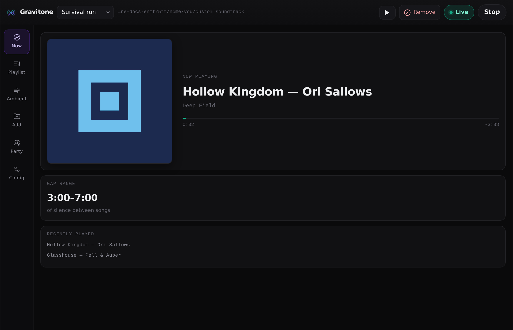
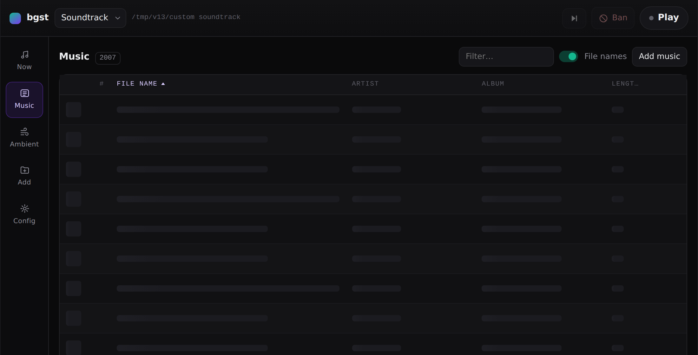
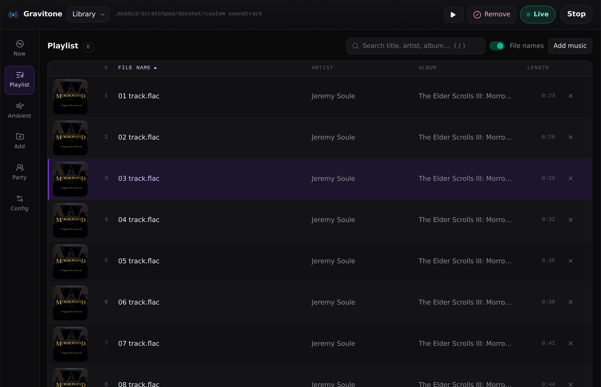
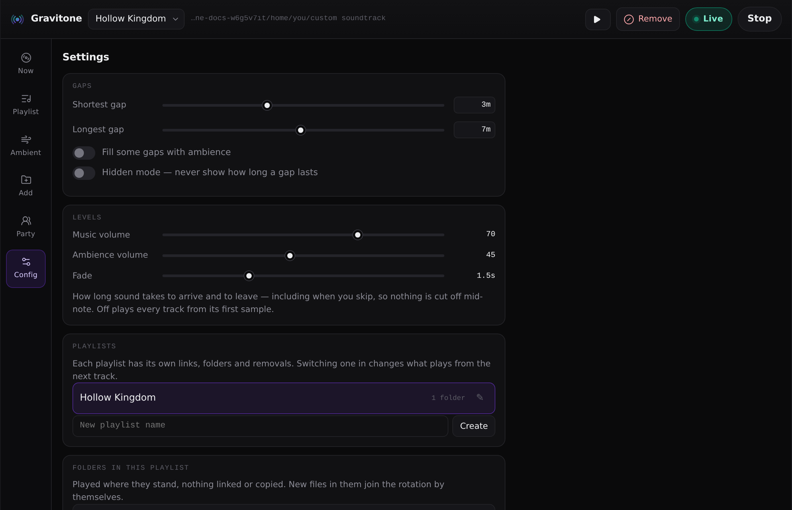
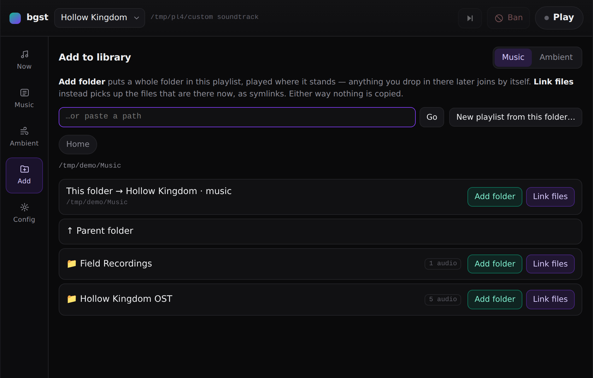

# custom_bg_game_soundtrack_player

Play a custom list of music files, with a customizable random silence / ambient
track duration in between.

Point it at music you already have, and it plays a shuffled soundtrack behind
whatever game you're in — with a random gap after each song that is either
silence or a bed of ambience (wind, rain, tavern noise, crickets).

- **Playlists.** Two folders you switch between — one per game, per mood, per
  session. Each keeps its own links, its own folders, and remembers which
  tracks you took out of it. Switching lands on the next track.
- **Two ways in, mixed freely.** *Link* a file and a symlink lands in your
  `custom soundtrack` folder, pointing at where it already lives — a 40 GB
  collection costs a few KB of directory entries. Or set a whole folder as a
  **folder** to a playlist and it plays in place, picking up whatever you drop
  in later.
  Nothing is ever copied.
- **A separate `ambient` folder and ambient folders** for loops and atmosphere.
- **Random gaps with sane defaults** — 12–45 s, 65 % of them ambient, the rest
  silence — tunable anywhere from none to a full hour, and hideable if you
  would rather not know how long the quiet lasts.
- **A tiny control panel** (`bgst ui`) that runs in your browser, or on your
  phone as a remote — no Electron, no build step, no dependencies.
- **No Python dependencies.** Playback goes through `ffplay`, `mpv`, `afplay`
  or `vlc`, whichever you have.



## Install

One script per platform. Each installs into a private virtualenv (or pipx if
you have it), puts `bgst` on your PATH, and offers to install an audio player
if you have none.

**Linux, macOS, *BSD, WSL**

```sh
git clone https://github.com/cheekoala/custom_bg_game_soundtrack_player
cd custom_bg_game_soundtrack_player
./install.sh                 # add --with-player to install ffmpeg without asking
```

**Windows** (PowerShell)

```powershell
git clone https://github.com/cheekoala/custom_bg_game_soundtrack_player
cd custom_bg_game_soundtrack_player
powershell -ExecutionPolicy Bypass -File .\install.ps1
```

**Any platform, by hand**

```sh
pipx install .          # or: pip install --user .
```

The installer offers to add a menu entry and a desktop shortcut (`--shortcut`
/ `--no-shortcut` to decide up front; `-Shortcut` / `-NoShortcut` on Windows),
and to put `~/.local/bin` on your PATH if it isn't already (`--path` /
`--no-path`) — otherwise `bgst` installs fine and then `command not found`.
It writes one line to your shell's own profile (`.zshrc`, `.bashrc`,
`config.fish`, `.profile`), once; open a new terminal afterwards. Until then
the full path works: `~/.local/bin/bgst ui`.

When it offers to open the control panel at the end, it starts it **detached**
(`setsid`), so the UI keeps running after that terminal window closes —
logging to `~/.local/state/bgst/ui.log`.

**Double-clicking `install.sh` in Dolphin, Nautilus or Thunar** used to look
like nothing happened: a file manager runs an executable script with no
terminal attached, so everything it prints goes to a pipe nobody reads, and
its questions have nowhere to appear. It now notices it has no terminal and
reopens itself in one (konsole, gnome-terminal, xfce4-terminal, kitty,
alacritty, foot, xterm — whichever you have), so you can watch the install and
answer its two questions. `--no-terminal` keeps it in place.

Uninstall with `./install.sh --uninstall` / `.\install.ps1 -Uninstall`; both
leave your library and config alone. `make help` lists the same tasks for
developers.

You also need one player: `ffmpeg` (for `ffplay`), `mpv`, or `vlc` — the
installers offer to fetch one. Check any time with `bgst doctor`.

## Use

```sh
bgst ui                                    # the control panel, in your browser
```

`bgst ui` starts the server *and* opens the page. Opening
`bgsoundtrack/ui/index.html` from the folder by hand gives you a dead page —
it has no server to talk to, so no library, no file browser, no playback. The
page says so if you land there.

Only one UI runs at a time: start it again (or click the shortcut again) and
it opens the browser at the one already running instead of fighting it for the
port. `bgst ui --stop` ends it, `bgst ui --new` starts a second one anyway. If
port 8765 is taken by something else, it moves to the next free port and says
so; with an explicit `--port` it reports the clash instead of moving.

Or from the terminal:

```sh
bgst init                                    # create the custom soundtrack folder
bgst playlist new "Hollow Kingdom" --folder ~/Music/Nier --use
bgst playlist new "Field Work" --folder ~/Sounds/recordings
bgst folder add --ambient ~/Sounds/weather   # into the selected playlist
bgst link ~/Music/Outer\ Wilds               # or link track by track
bgst play
```

While playing in a terminal: `n` skips, `b` bans (skip and drop it from this
playlist), `q` quits.

```
♪ Ashes.flac
  ~ rain.ogg (0:34)
♪ Village.mp3
  . silence (0:19)
```

## Speed and stability

Everything that walks the disk happens on one background worker, never on a
request. The folder index is written to `~/.config/bgsoundtrack/index.json`,
so a restart starts with answers rather than work, and the state the UI polls
once a second is worked out only when something actually changes.

On a 2000-file library: a poll costs ~0.02 ms (it used to re-walk every
folder), and the server starts answering immediately instead of after the
first scan. Tag reads and cover extraction also happen in the background —
the Server card in Config shows what is being worked on.

The track table builds 400 rows at a time and has a **search box**; with
thousands of tracks the page stays responsive instead of parking tens of
thousands of nodes in the DOM. *Show all* is there when you want it.

A refresh that would draw the same rows patches them in place instead of
rebuilding the table, so **where you scrolled to stays where you scrolled
to** while the tags and covers fill in around you.

Anything in flight shows a thin sweeping bar across the top of the window,
and buttons that take a moment (exporting a bundle, finding art) spin while
they work. A library that takes a second to arrive shows pulsing placeholder
rows rather than an empty table, and cover cells pulse while art is being
read.



## Server controls

Config → **Server** shows the address, the process id, how long it has been
up and its version, with **Restart** and **Stop** buttons. Restart replaces
the process in place, keeping the same port *and the same token*, so the page
you clicked it from reconnects by itself.

From a terminal:

```sh
bgst ui --status      # is one running, where, and since when
bgst ui --stop        # stop it
bgst ui --new         # a second one anyway
```

## The UI

`bgst ui` serves a small control panel on `127.0.0.1:8765` and opens it. It is
plain HTML, CSS and JavaScript served by Python's own HTTP server — no
Electron, no build step, no dependencies, nothing loaded from the internet.

| | |
| --- | --- |
|  |  |
|  | |

- **Top bar** — the playlist selector; switching it switches what plays.
- **Now** — what is playing, named from its tags (`Anchor — Vela`, with the
  album underneath and the cover beside it) or how long the current gap runs,
  with history. Tags for the playing track are read on the spot, so this
  works whether or not you have opened the library table.
- **Music / Ambient** — the two libraries; `✕` removes a link, never a file.
- **Add** — *Choose a folder…* opens your desktop's own folder dialog (needs
  Tk; `bgst doctor` says whether you have it). Otherwise browse from the
  built-in file browser or paste a path — a web file picker hands over file
  *contents*, never paths, and paths are what linking needs. Every folder row
  offers **Add folder** (the whole folder joins this playlist, live) and
  **Link files** (just the files in it now, as symlinks), plus *New playlist
  from this folder…*.
- **Config** — gaps, levels, shuffle, loop, your playlists (rename, delete,
  create), this playlist's folders and removed tracks, and export/import. Changes save
  immediately and take effect from the next gap; no need to restart playback.

Keys: `space` play/stop, `n` next, `b` ban. Every API call needs the token in the URL,
so another page in your browser cannot drive your player or read your disk.

Run it as a phone remote for the machine that's playing:

```sh
bgst ui --host 0.0.0.0        # prints a LAN URL with the token
```

Anyone who has that link can control playback, so use it on networks you
trust.

## Playlists

Already have two folders you think of as two playlists? Make them two:

```sh
bgst playlist new "Hollow Kingdom" --folder ~/Music/hollow-kingdom --use
bgst playlist new "Night Drive"    --folder ~/Music/night-drive
bgst playlist list
bgst playlist use "Night Drive"
```

Or pick them from the selector in the top bar of the UI. A playlist owns:

- its **folders**, played in place;
- its own **links**, in `custom soundtrack/playlists/<id>/`;
- its **removals** — take a track out with `✕` (or `bgst unlink NAME`) and it
  stays out of *this* playlist, remembered across restarts. The same file
  keeps playing in any other playlist that points at it, and the file itself
  is never touched. Put it back from Config → *Removed from this playlist*,
  or `bgst playlist restore --all`.

Removing a **linked** track deletes that playlist's link instead — there is
nothing to remember, and the other playlists keep theirs.

Switching playlist while music is playing takes effect at the next track, not
the next full pass — as does linking, removing, or adding a source.

The playlist called **Library** is the plain `custom soundtrack/music` and
`/ambient` folders, so an install from before playlists keeps working exactly
as it did, folders and all.

Playlists live in `~/.config/bgsoundtrack/playlists.json` — plain JSON, easy
to read, back up, or edit by hand.

## Album art

Covers come from **the picture inside the file**, and only from there — a
`cover.jpg` lying in the folder is someone else's idea of what the record
looks like, so it is ignored. Tag the files and bgst will find it.

Plenty of rips carry the picture on one track and not the rest, so a record
is read across its first few files before it is called coverless. Both
answers — the cover and the "there is none" — are written to
`~/.config/bgsoundtrack/covers/index.json`, so a restart asks nothing again.

**A record is a folder and an album tag, not a folder.** Keeping a whole
game's music in one directory is normal, and one answer per directory meant
whichever album happened to be listed first decided for everything below it:
six coverless tracks at the top of the folder hid the art on the rest. Tracks
are grouped by what their album tag says, and only the tracks of that album
are read looking for its picture.

The picture is lifted out byte for byte and the format read off the bytes,
not off the type the tagger wrote down. A JPEG filed as `image/png` is
common, and decoding it by the label fails outright — the wrong decoder is
picked and refuses a picture that is perfectly good. It is shrunk to 600px
afterwards, from the file rather than from the label.

Before running ffmpeg at all, the file's header is checked for an attached
picture: 45 ms to ask versus about 3 s for ffmpeg to scan a whole file and
find nothing.

**Config → Find album art** goes through the playlist in the background,
reading the records nobody has asked about yet; **Look again** throws every
answer away and re-reads the lot, for after you have added art to files. It
reads the tags first, since they are what says where one record ends and the
next begins. Art is cached in `~/.config/bgsoundtrack/covers/`, one file per
record, since a record shares its cover, and `bgst doctor` says how many
records have art and how many are known not to.

A cover is fetched **once per record, not once per track**, and served with
an ETag and a week of cache headers. The token the page uses is kept in
`~/.config/bgsoundtrack/token` rather than made up at every start, so a
restart reuses the browser's cached art instead of re-fetching all of it;
`bgst ui --new-token` throws the old one away when you want that.

Now shows the cover of what is playing at full size, next to the title,
artist and album; the table shows a thumbnail per row.

## The track table

Each library is a table — track number, title, artist, album, length — and
**clicking a column header sorts by it**, the same header again reverses it.
The order sticks (it is a setting) and it is also the play order when shuffle
is off.

The **File names** switch decides what the first column is: the file on disk,
or the title tag. Whichever it shows is what its header sorts by, so the
column and the sort never disagree.

```sh
bgst list --sort album        # name, title, artist, album, length
bgst config sort_by=artist sort_desc=true
```

Tags come from `ffprobe` (part of ffmpeg). Anything it cannot read falls back
to the path — `Artist/Album/03 Title.flac` is a convention for a reason —
and a guessed artist or album is shown in italics rather than passed off as a
tag. Tags are read in the background and cached in
`~/.config/bgsoundtrack/tags.json`, so a listing never waits on a probe: the
table fills in the moment the read lands, and says how many are left while it
works.

## Searching

Every list has a **search box** above it. Type and the table narrows as you
go, matching across the file name, title, artist, album and path; several
words all have to match, in any order and any field, so `bell vela` finds the
Vela track by Bell. It says `3 of 7` beside the box so you know what you are
looking at. `/` (or Ctrl-F) jumps to it from anywhere on the page, Escape
clears it.

The header stays put while you scroll. Columns keep their share of the width
and truncate with an ellipsis (the full value is in the tooltip), so a
sprawling album title can never push the table out of its panel. On a phone
the artist, album and length columns fold away, leaving the track and its
title, and the filter box takes its own line.

The window is 1440px wide at most, so a desktop gets a properly wide table
without the settings cards stretching into something silly.

## Export and import

Two shapes, for two jobs:

```sh
bgst export ~/bgst-library.json                    # a manifest: what is in each playlist
bgst export ~/library.csv --format csv             # the same, flat, one row per track
bgst export ~/share.zip --bundle --only "Night Drive"   # a zip with the audio inside
bgst import ~/share.zip                            # adds playlists, never overwrites
```

A **manifest** is small, readable JSON listing each playlist's folders, links
and removals. It points at files rather than carrying them — right for your
own backup, or moving to a machine that has the same music on it. Import
reports anything that isn't there.

A **bundle** is a zip with the audio in it, so someone else can unpack it and
hear what you hear. Importing one unpacks to
`custom soundtrack/imported/<name>/` and makes playlists that play it.
(Paths inside a bundle are checked before extraction — a zip cannot write
outside that folder.)

Either can be driven from Config → *Export & import*, which uses your
desktop's save/open dialog where there is one and a path box where there
isn't. Import always **adds**: a name that already exists becomes
`Hollow Kingdom (2)` rather than replacing anything.

## The library

```
custom soundtrack/
├── music/      symlinks -> your songs, wherever they live
└── ambient/    symlinks -> your ambience

plus any folders you added, played where they stand
```

**Linked** files are curated one by one and stay put even if you reorganise
the original folder later. **Folders** are the low-effort option: point a playlist
at `~/Music/Soundtracks`, and every audio file under it plays, including
whatever you add next week. A file reachable both ways is only played once.

```sh
bgst folder add ~/Music/Soundtracks      # a music folder for this playlist
bgst folder add --ambient ~/Sounds       # an ambience folder
bgst folder list                         # with per-folder track counts
bgst folder remove ~/Music/Soundtracks   # the folder itself is untouched
bgst ui --pick                           # pick one from a system dialog
```

(`bgst source …` still works — same command, older name.)

Because entries are plain symlinks, you can also manage the folder by hand —
drag links in with your file manager, rename them to change sort order, delete
one to drop a track. The player ignores non-audio files and dangling links.

| Command | |
| --- | --- |
| `bgst ui` | open the control panel (`--host 0.0.0.0` for a phone remote) |
| `bgst play` | play in the terminal (`n` next, `q` quit) |
| `bgst link PATH...` | symlink files/folders in (`--ambient`, `--no-recursive`, `--relative`) |
| `bgst folder add\|remove\|list` | put whole folders in this playlist (`--ambient`) |
| `bgst playlist list\|new\|use\|rename\|remove` | switch between sets of music |
| `bgst playlist removed\|restore` | see and undo removals in this playlist |
| `bgst export PATH [--bundle\|--format csv]` | write playlists out, with or without the audio |
| `bgst import PATH` | read one back in as new playlists |
| `bgst list --sort album` | order by name, title, artist, album or length |
| `bgst play --hidden` | play without ever showing gap lengths |
| `bgst ui --stop\|--new` | stop the running control panel, or start a second |
| `bgst unlink NAME...` | remove entries (only ever deletes symlinks, never real files) |
| `bgst list --targets` | show the library and what each link points at |
| `bgst prune` | drop links whose target moved or was deleted |
| `bgst doctor` | check folders, tracks and available players |

Any command takes `--playlist NAME` to act on a playlist without selecting it.

`--relative` writes relative symlinks, which keep working if the library and
your music move together (e.g. both on one external drive).

On Windows, symlinks need Developer Mode (Settings → System → For developers).
Without it `bgst` falls back to hard links, which also cost no extra space but
cannot cross drives.

## Ban

**Ban** sits beside skip and never moves. Press it (or `b`) and a confirm
button drops down *on its own layer* naming the track — the buttons
underneath stay exactly where they were, so the thing under your cursor is
still the thing you were aiming at. Press the confirm (or `b` again) to go
through with it; click anywhere else, press `Escape`, or wait eight seconds
and it forgets.

Confirming skips the track *and* takes it out of the current playlist — the
same removal the `✕` does, so a track from a folder is only remembered as
gone and the file is never touched. Undo it in Config → *Removed from this
playlist*.

The confirmation names the track it armed on, and the server checks that name
before acting: if the music moved on while the confirm was sitting there,
nothing is banned. Ban during ambience bans the ambient track instead; during
silence there is nothing to ban.

## Gaps between songs

Every song is followed by a gap of a random length between `gap_min` and
`gap_max`. Each gap independently becomes either ambience (probability
`ambient_chance`, a random track from `ambient/`, cut to the gap length) or
plain silence. Gaps shorter than `ambient_min_tail` stay silent — a two-second
smear of rain sounds like a mistake.

| Setting | Default | |
| --- | --- | --- |
| `gap_min` / `gap_max` | `12` / `45` | gap length range, seconds — up to `3600` (an hour) |
| `ambient_chance` | `0.65` | share of gaps that get ambience |
| `ambient_min_tail` | `3.0` | shortest gap worth filling with ambience |
| `ambient_random_start` | `true` | drop into an ambient track at a random point |
| `hide_gaps` | `false` | hidden mode: never show how long a gap runs |
| `sort_by` | `name` | list and play order: name, title, artist, album or length |
| `sort_desc` | `false` | reverse that order |
| `show_filenames` | `true` | first column is the file on disk, not the title tag |
| `volume` / `ambient_volume` | `70` / `45` | ambience sits under the music |
| `shuffle` | `true` | shuffled passes; no repeat until all have played |
| `loop` | `true` | start a new pass when the list is exhausted |
| `root` | `~/.local/share/custom soundtrack` | library location |

The gap sliders reach an hour on a curved scale, so the first third of the
travel still covers 0–60 s. Type an exact value into the box beside them
instead if you prefer: `90`, `90s`, `3m`, `2m30`, `1:30` all work.

**Hidden mode** (`hide_gaps`, or `bgst play --hidden`) withholds gap lengths
*server-side* — the browser is never told how long the quiet is or how much is
left, so there is no countdown to watch and nothing to peek at in the network
tab. Songs still show their progress.

**Ambient start points** are randomised by default, so a twenty-minute rain
recording doesn't open on the same three seconds every time. It needs
`ffprobe` (part of ffmpeg) to know how long the file is; without it, ambience
starts at the top. The offset always leaves enough track to cover the whole
gap.

Change them for good, or just for one session:

```sh
bgst config gap_min=30 gap_max=120 ambient_chance=0.8   # saved
bgst config                                             # show everything
bgst play --gap-min 60 --gap-max 180 --no-ambient       # this run only
```

Other `play` flags: `--volume`, `--ambient-volume`, `--no-shuffle`, `--no-loop`,
`--player ffplay|mpv|afplay|vlc`, `--seed N` (reproducible shuffle and gaps).

Settings live in `~/.config/bgsoundtrack/config.json`. `BGSOUNDTRACK_ROOT` and
`BGSOUNDTRACK_CONFIG` override the paths, and `--root` / `--config` override
them per command — handy for a separate library per game.

## Cross-platform

| | |
| --- | --- |
| Linux, macOS, *BSD, WSL | `./install.sh` |
| Windows 10/11 | `install.ps1` |
| Playback | ffplay, mpv, afplay or vlc — whichever is installed |
| Runtime | Python 3.9+, standard library only |
| File chooser | your desktop's own, when Tk is installed; a built-in browser otherwise |
| UI | any browser, including a phone on the same network |

## Volume

The in-app sliders drive the **system mixer** (PulseAudio / PipeWire, via
`pactl`) for the track that is playing right now, and fall back to the
player's own volume flag for the next one. That matters because `ffplay`
reads `-volume` once at startup and offers no way to change it afterwards —
which is why, before this, moving the app slider mid-song did nothing on
Fedora/Plasma while the desktop's own mixer worked fine.

Players are also tagged as `bgst` (`PULSE_PROP_application.name`), so your
desktop's volume mixer shows one **bgst** entry to ride rather than a new
`ffplay` appearing for every song.

If `pactl` is missing (a pure-ALSA box, macOS, Windows), a volume change
applies from the next track and the UI says so.

## After an upgrade

Reinstalling replaces the files on disk, but a UI that is **already running**
keeps the old code in memory while serving the new page from disk — so the
page asks for things the server has never heard of (`unknown setting
'sort_desc'`), or columns come up empty. bgst now notices:

- the page shows a banner saying it was updated and what to run;
- `bgst ui` refuses to quietly hand you the stale one: in a terminal it offers
  to restart it, and from a shortcut it says so in a dialog;
- `bgst doctor` reports it too.

The fix is always the same:

```sh
bgst ui --stop && bgst ui
```

## When the shortcut seems to do nothing

A desktop shortcut runs with no terminal, so anything printed is lost. bgst
now puts failures on screen instead (kdialog, zenity, xmessage or a Tk dialog,
whichever exists), including "running, but no browser opened — go to
`http://…`". The three things that used to fail silently:

| | |
| --- | --- |
| Port 8765 already taken | moves to the next free port, or says so with `--port` |
| A UI already running | opens the browser at that one; `--stop` to end it |
| Upgraded while running | banner in the page, offer to restart from the terminal |
| `bgst: command not found` | `~/.local/bin` is not on PATH — see Install, or use the full path |
| Started from the installer, terminal closed | now launched detached, survives it |

Its log, when started from the installer or a shortcut, is
`~/.local/state/bgst/ui.log`.

## Tests

```sh
python -m pytest
```

Most of it needs nothing but Python. `tests/test_layout.py` drives a real
browser to check the table stays inside its panel and the header sticks —
CSS facts that no amount of Python can see — and skips itself when there is
no chromium to drive.

No test needs an audio device: playback is faked and the clock is injected,
so the suite runs in about a second anywhere.

## License

MIT — see [LICENSE](LICENSE). Free software, no telemetry, no network calls
beyond the local UI you start yourself.
